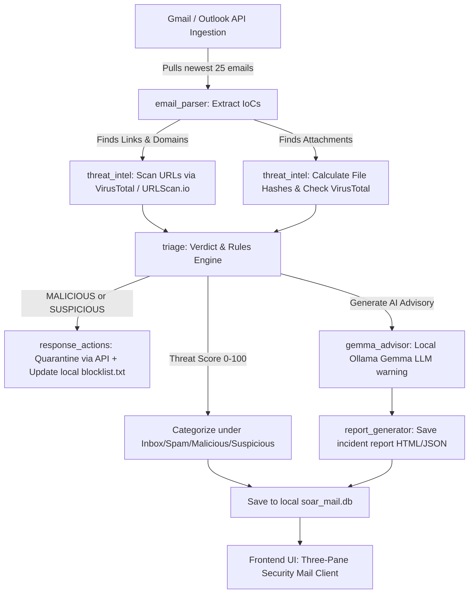

# 🛡️ SOAR Secure Mail Client (Phishing Detection & Automated Response)

**FoSC 23CSE313 Hackathon** | Team of 4-5 Members | 6-Hour Sprint Playbook

---

## 🌟 What is this Project? (For Non-Technical Users)

Imagine you receive an email that looks exactly like a login alert from **PayPal** or **Microsoft**, telling you that your account is suspended and asking you to *"click here immediately to verify your identity."* If you click it, the hackers could steal your credentials. 

The **SOAR Secure Mail Client** is a smart, automated email inbox assistant designed to protect you from this. 

### What it does:
1. **Onboarding Sign-In**: When you open the app, it presents a secure, clean screen asking you to connect a real Gmail or Outlook account.
2. **Real-Time Inbox Scanner**: Once logged in, it pulls your latest emails (limited to the last 25 for fast response) and monitors for new ones.
3. **Automated Security Check**: Every time an email arrives, it inspects:
   - **Links**: Are they pointing to fake/suspicious websites?
   - **Attachments**: Do they contain hidden viruses or malware?
   - **Sender Identity**: Is the sender's domain spoofed or unauthorized?
4. **Local AI Warnings (Gemma)**: A local artificial intelligence model running on your computer (**Gemma**) reads the email body and writes a plain-text warning card right inside the email showing exactly *why* this email might be dangerous and what you should *not* do.
5. **Immediate Protection (Quarantine & Block)**: If an email is flagged as malicious, the client automatically moves it to your spam folder (quarantining it) and adds its dangerous links to a local blocklist so you cannot click them.

---

## 📋 System Architecture

Here is a visual map of how the system processes your emails in the background:



---

## 🚀 Key Features

* **Premium Theme Options**: Toggle between Cyberpunk Dark Mode and Light Mode instantly using the button in the sidebar.
* **Indian Standard Time (IST) Clock**: Displayed clearly in the top bar to track real-time inbox actions locally.
* **Dynamic Loading & Adaptive Cards**: The security warnings dynamically scale their heights depending on the size of the AI advisory to prevent scrolling issues.
* **No Mock accounts**: The dashboard runs exclusively on real linked Google or Microsoft mailboxes.

---

## 🛠️ Quick Setup Guide

### 1. Install Dependencies
Make sure you have **Python 3.8+** installed. Then run:
```bash
pip install -r requirements.txt
```

### 2. Configure Your Secret Keys
1. Copy the template settings file to create your credentials config:
   ```bash
   copy .env.example .env
   ```
2. Open the new `.env` file and add your custom API Keys:
   - **VirusTotal API Key**: Sign up for a free account at [VirusTotal](https://www.virustotal.com) to get an API key.
   - **URLScan.io API Key**: Sign up for a free account at [URLScan.io](https://urlscan.io) to generate an API key.

### 3. Setup Google Gmail OAuth Credentials
To authorize Gmail connection, the app uses standard Google credentials.
1. Place your Google Cloud project's client configuration file in the project folder and name it `credentials.json`.
2. On your first onboarding run, the app will automatically open a browser window requesting you to log in with your Google Account and approve permissions.
3. Your secure token will be saved locally inside `token_gmail_<yourname>@gmail.com.json` so you never have to sign in again.

### 4. Setup Local AI (Ollama + Gemma)
1. Install [Ollama](https://ollama.com/) on your computer.
2. Open your terminal and download the Gemma model:
   ```bash
   ollama pull gemma4:e2b
   ```
3. Keep Ollama running in the background. The app will automatically connect to it to generate warnings.

### 5. Launch the Server
Start the client application by running:
```bash
python server.py
```
A browser window will automatically launch at **`http://localhost:5000`**.

---

## 📁 Project Structure

* **`server.py`**: The Flask web server that communicates between the database, mail APIs, and your browser interface.
* **`main.py`**: The background pipeline orchestrator that fetches, extracts, checks threat intelligence, triages, and reports emails.
* **`db_manager.py`**: Handles local SQLite persistence (`soar_mail.db`) so email records load instantly.
* **`email_parser.py`**: Extracts web links, domains, and files from messages.
* **`threat_intel.py`**: Checks files and URLs against VirusTotal and URLScan reputation databases.
* **`triage.py`**: Contains the rules and risk scoring engine to decide whether a mail is `MALICIOUS`, `SUSPICIOUS`, or `CLEAN`.
* **`response_actions.py`**: Quarantines unsafe emails and logs malicious domains in `blocklist.txt`.
* **`gemma_advisor.py`**: Interfaces with Ollama to prompt the Gemma LLM for security warnings.
* **`report_generator.py`**: Generates local JSON tickets and HTML reports for incident tracking.
* **`dashboard/`**: Contains the HTML layout (`index.html`), stylesheet (`style.css`), and frontend controller logic (`app.js`).

---

## 🎯 Threat Triage Rules & MITRE ATT&CK Mapping

Emails are categorized based on their Threat Score (0 to 100):

| Score Range | Verdict | Action Taken |
| :--- | :--- | :--- |
| **60 to 100** | 🔴 MALICIOUS | Move to quarantine folder + Block URLs + Send notification |
| **30 to 59** | 🟡 SUSPICIOUS | Move to quarantine folder for analyst review |
| **0 to 29** | 🟢 CLEAN | Keep in Inbox |

### MITRE ATT&CK Techniques Covered:
- **T1566 (Phishing)**: Detected by evaluating headers and known bad URLs.
- **T1566.001 (Spearphishing Attachment)**: Checked by hashing attachment contents and validating reputation.
- **T1566.002 (Spearphishing Link)**: Tracked by inspecting embedded URLs using API intelligence.
- **T1598 (Phishing for Information)**: Assessed by scanning for sensitive query keywords inside message body.

---

## 🔒 Security Best Practices

- **Never Commit Secrets**: The `.gitignore` file is configured to exclude your `.env` keys, local database caches, and OAuth tokens (`token*.json`) from being pushed to GitHub.
- **Secure Credentials**: Credentials are stored only on your local system.
